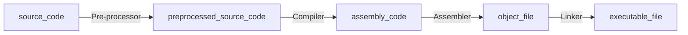
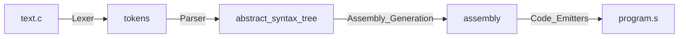

# What is the SCC?
Simple C compiler (SCC) is a simple compiler of C language that is implemented by Python.


# Quick Start
```
./driver.py <filename>
```
Currently, support the following flags.
- `--lex`: Run only the lexer pass.
- `--parse`: Run the lexer and parser passes.
- `--codegen`: Run the lexer, parser, and code generation passes.

Example:
```
./driver.py tests/resources/multi_digit.c   
```
Running this command will execute the driver logic to generate an assembly file for the input c file.

# What is a compiler?
The compiler is a program that translates one language to another, in this case, converts source code written in C to Assembly.

<b>From source code to executable file:</b>


# Design
## Compiler passes
The source code goes through 4 passes to be converted into an assembly file, shown as follows:

**Description**:
- Lexer pass: breaks up the source code into a list of tokens.
- Parser pass: converts a list of tokens into AST -> easy to traverse and analyze.
- Assembly Generation pass: converts AST into assembly and organizes in a structure required by the compiler.
- Code Emission pass: writes those assembly structures to file.

